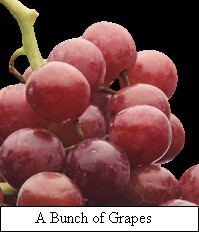



## Use GDI\+ \( aka GDIPlus \) with VB6 and Win98\!

### Description

Yes, you can use GDI+ with VB6 (and maybe previous versions with a little editing) along with Win98 or better! Fixed GdiplusShutdown declaration [8/3]. Added ImageLockMode and ImageCodecFlags enums [1/22]. Dana Seaman contributed the translation of the huge EmfPlusRecordType enum and I fixed a frame delay bug in Play GIF [12/4]. Dana created an even better function for getting all GUID constants [12/19]. The goal was to simply port the C++ APIs to VB6, and as I never personally found any comprehensive examples or declarations, although there was one newsgroup post mentioned to me that clarified one issue holding me back (See "HOWTO: call

GDIPLUS directly from VB6" in comp.lang.basic.visual.misc), I decided to port nearly 30 SDK samples and declared basically every single API I could find and the required enums and constants. There is so much, I hope I didn't miss anything else... Estimated API conversion accuracy: 99% Correct. If you don't have WinXP, you may need the GDI+ Redistributable RTM which is available here: http://www.microsoft.com/downloads/release.asp?releaseid=32738 . . . You should also read the beginning of the GDIPlusAPI module, as it has some useful information. If you find anything wrong, complain away, but show the fix when possible! I don't like when people have a problem and then simply say "I fixed it", as others may have a similar problem and not know how to fix it. I encourage everyone to edit the sample, post better samples, and make some classes to simplify the GDI+ usage even more! I'm not great at writing boring or even exciting introductions, so I'll try my best to explain some core ideas to you, and the code is also heavily commented, though not "well" commented. A GDI+ object class, for the purposes of VB, is simply a pointer (aka Long). The pointer, once retrieved, is simply passed ByVal to the API functions. All you really have to worry about is remembering to delete the object that the pointer represents when you are done. You could also think of the pointer as a handle, if it helps you understand better. Some API functions also want arrays of types for a parameter (you'll usually see a count parameter associated with that function). Another important fact to remember is that ALL strings that GDI+ returns or uses MUST BE UNICODE! In this code I opted to use StrConv to achieve Unicode strings, and the APIs are accordingly declared As String, but you can alter the APIs to use the StrPtr result if you like by selecting the API function declarations and Replace " As String" with " As Long". I opted not to do that as I feared I might forget what type of variable is really required, although doing so improves performance. Also, if you see "argb" floating around, it stands for Alpha-blending, Red, Green, and Blue - it is the color "encoding" scheme used by GDI+. I hope this will quickly cover some of the finer points about GDI+, but I can't rival the explainations of the GDI+ documentation: http://msdn.microsoft.com/library/en-us/gdicpp/gdi+/gdi+.asp?frame=true . . . Notes about the example code: Look at the mnuRedraw_Click menu event to see a list of available samples, and uncomment them to view the demo. I did this to encourage you to view the source. For the thumbnail sample, you'll have to insert the filename of a huge file you'd like to view the thumbnail for. There is also a very basic "freehand" curve drawing demo under the file menu [9/4]. Added a rough on demo how to play an animated GIF [9/7]. Added a SaveGrayscale demo with code from Dana Seaman [11/26]. Added a wrapper demo from Dana [11/30]. Added a DrawTextBackColor demo [1/18]. Added a LockBits demo [1/22]. Added two different BMPtoGIF demos [2/6].
 
### More Info
 

             |
---                |---
**Submitted On**   |2003-08-01 00:29:16
**By**             |[Avery](https://github.com/Planet-Source-Code/PSCIndex/blob/master/ByAuthor/avery.md)
**Level**          |Advanced
**User Rating**    |4.9 (246 globes from 50 users)
**Compatibility**  |VB 6\.0
**Category**       |[Graphics](https://github.com/Planet-Source-Code/PSCIndex/blob/master/ByCategory/graphics__1-46.md)
**World**          |[Visual Basic](https://github.com/Planet-Source-Code/PSCIndex/blob/master/ByWorld/visual-basic.md)
**Archive File**   |[Use\_GDI\+\_\(1627568102003\.zip](https://github.com/Planet-Source-Code/avery-use-gdi-aka-gdiplus-with-vb6-and-win98__1-37541/archive/master.zip)

